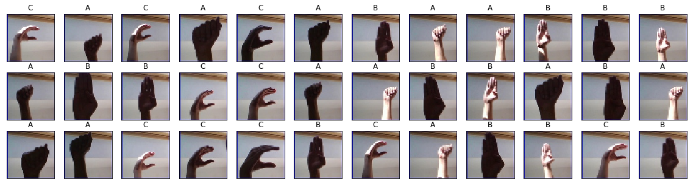
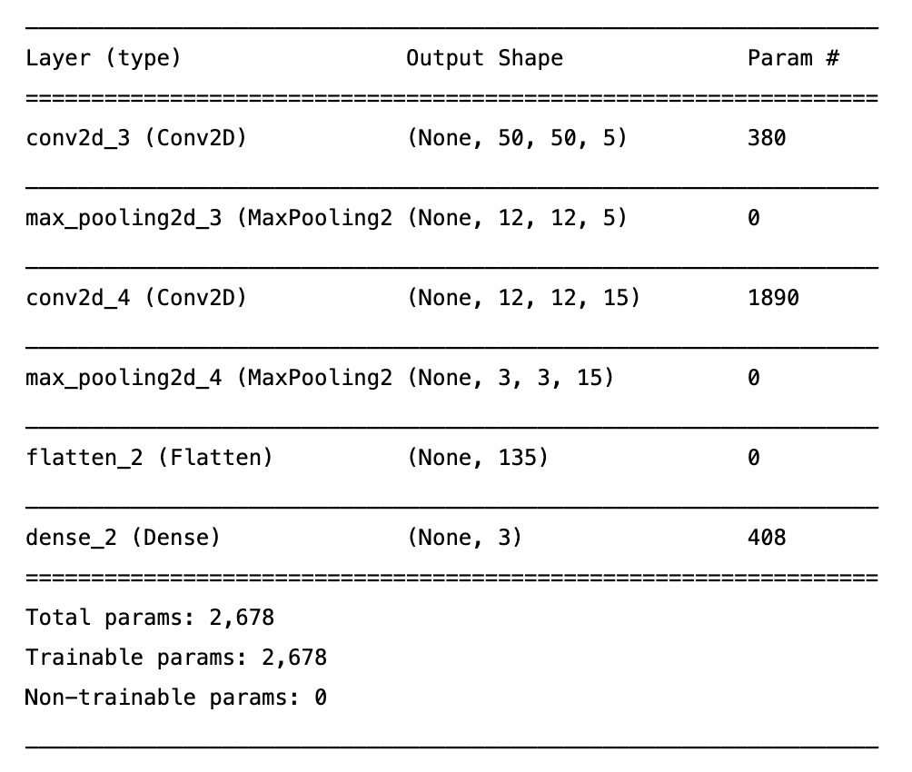
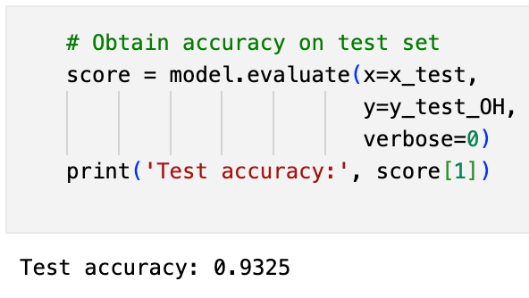
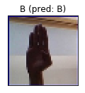

# ASL-Recognition-with-Deep-Learning
Created CNN that identifies letters from sign language images

## Overview

This project shows my results for the DataCamp project titled, "ASL Recognition with Deep Learning". The dataset contains 50x50 images containing a hand performing sign-language, and the goal is to train a neural network to determine the letter being relayed in each image. Below are sample images from the dataset. The dataset only contains images of three letters: A, B, and C. 

## Architecture

The following images displays the architecture of the model. There are two convolutional layers, the first with 5 filters and the second with 15. The kernel size was 5, meaning this filters used were 5x5. Two max pooling layers were added in order to highlight the relevant features in the model. This is the reason that the total number of parameters is only 2,678. The dense layer contains 3 outputs, since there are only three letters being classified: A, B, an C.

## Results

The model achieved 93% accuracy on the test data. This illustrates the power of convlutional layers when combined with max pooling.

Here is an example of an image the model failed to interpret: 

The model may have had difficult identifying the placement of the thumb and therefore mislabeled the image. To improve this model, image augmentation could be added, and the number of epochs could be increased. In addition, applying dropout layer could improve the model.
